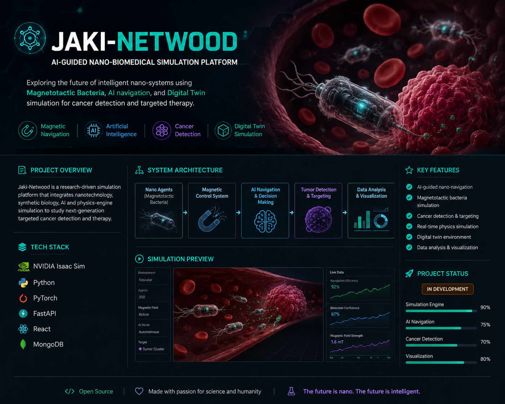

<p align="center">
  
</p>

<h1 align="center">JAKI-NETWOOD</h1>

<p align="center">
AI-Guided Nano-Biomedical Simulation Platform
</p>

---


## Overview

Jaki-Netwood is an advanced nano-biomedical simulation project combining:

- Magnetotactic Bacteria
- Artificial Intelligence
- Digital Twin Systems
- Nano Navigation
- Cancer Detection Concepts
- Immune Priming Simulation

The platform explores how programmable bio-agents could navigate vascular environments using AI-assisted magnetic guidance.

---

## Tech Stack

- NVIDIA Isaac Sim
- NVIDIA Omniverse
- Python
- PyTorch
- React / Next.js
- Three.js

---

## Features

- AI-guided nano-navigation
- Magnetic steering simulation
- Digital Twin visualization
- Tumor targeting concepts
- Swarm coordination
- Physics-based simulation

---

## Project Structure

```bash
simulation/
ai/
frontend/
backend/
visuals/
docs/
